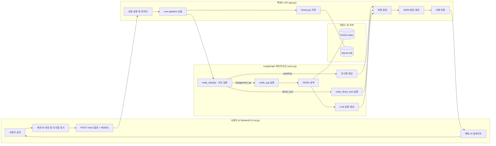
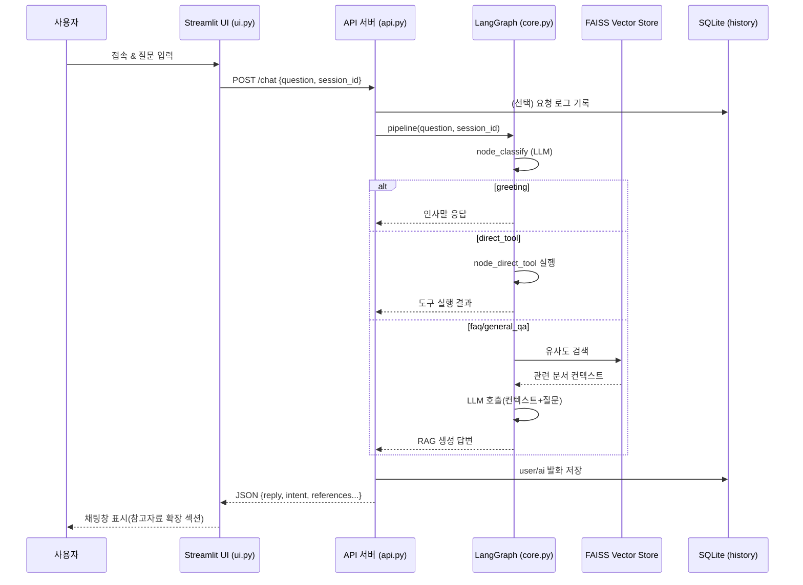
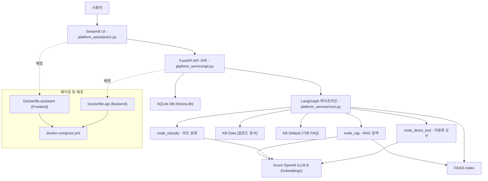

# 🌞 사내 헬프데스크 챗봇 (RAG + LangGraph)

이 프로젝트는 LangChain, FastAPI, Streamlit을 활용하여 구축된 사내 헬프데스크 챗봇 애플리케이션입니다. 
RAG(검색 증강 생성) 기술을 사용하여 사내 문서 기반의 답변을 제공하고, 특정 요청에 대해서는 미리 정의된 기능을 실행하는 에이전트 역할을 수행합니다.

-   **UI**: Streamlit
-   **Backend API**: FastAPI
-   **오케스트레이션**: LangGraph (인텐트 라우팅)
-   **검색**: FAISS + LangChain (PDF/CSV/TXT/DOCX 지원)
-   **모델**: Azure OpenAI (AOAI)

---

## 💡 주요 기능

- **대화형 헬프데스크 서비스**  
  - Streamlit 기반 UI(`platform_assistant/ui.py`)를 통해 직관적이고 사용자 친화적인 대화 환경을 제공합니다.  
  - 세션 관리와 대화 기록 조회 기능을 포함하여, 사용자와의 상호작용 히스토리를 체계적으로 관리할 수 있습니다.  

- **RAG (Retrieval-Augmented Generation) 기반 응답 생성**  
  - `./kb_data` 디렉터리에 저장된 사내 매뉴얼, 정책 문서, 업로드 자료를 벡터 스토어로 인덱싱하여 활용합니다.  
  - 이를 통해 단순 질의응답을 넘어, **정확하고 문맥에 맞는 답변**을 제공합니다.  

- **LangGraph 기반 인텐트 분류 및 라우팅**  
  - 사용자의 발화 의도를 분류하여 적절한 워크플로우 노드로 라우팅합니다.  
  - 일반 FAQ, 문서 검색, 툴 실행 요청 등을 유연하게 전환할 수 있으며, 멀티 에이전트 확장도 고려된 구조입니다.  

- **업무 자동화 툴(Predefined Tools) 제공**  
  - 사내 헬프데스크에서 반복적으로 발생하는 요청을 자동화된 절차로 제공합니다.  
    - **ID 발급 신청 안내**  
    - **비밀번호 초기화 절차 안내**  
    - **업무/화면별 담당자 정보 조회**  
  - 향후 신규 툴을 손쉽게 추가할 수 있도록 API 및 워크플로우와 분리된 구조로 설계되었습니다.


---

## 📄 프로젝트 구조

전문적인 개발 및 유지보수를 위해 소스코드(`src`)는 **업무 로직/서버(`platform_service`)**와  
**사용자 인터페이스(`platform_assistant`)**로 명확히 분리되어 있습니다.

- **platform_service**
  - `api.py` : FastAPI 기반 API 서버
  - `core.py` : RAG 파이프라인 및 워크플로우 정의
  - `db/` : SQLite 기반 DB 모듈 (`history.py` 등)
  - `constants.py`, `logging_config.py` : 공통 유틸/설정
- **platform_assistant**
  - `ui.py` : Streamlit 기반 UI, API 호출 전용 클라이언트 역할

추가적으로:
- **docker** : `Dockerfile.api`, `Dockerfile.ui`, `docker-compose.yml` 등을 포함한 컨테이너 실행/배포 설정
- **tests** : `pytest` 기반 자동화 검증을 위한 테스트 스위트

```
service-desk-assistant/
├── platform_assistant/       # 🌞 챗봇 UI 
│   └── ui.py                 # Streamlit 실행 파일
├── platform_service/         # ⚙️ API 서버 & 워크플로우
│   ├── __init__.py
│   ├── api.py                # FastAPI 서버
│   ├── core.py               # AG 파이프라인 및 워크플로우 정의
│   ├── constants.py          # 공통 상수/경로 (.env 반영)
│   ├── logging_config.py     # 로깅 설정
│   └── db/
│       ├── __init__.py       # DB 패키지 초기화 모듈 (공통 DB_PATH 정의 및 init_all 함수 제공 가능)
│       └── history.py        # DB 초기화/저장/조회
├── tests/                    # 🧪 테스트 코드
│   ├── __init__.py
│   └── test_api.py           # API + workflow 테스트
├── README.md                 # 📄 프로젝트 설명서
├── pyproject.toml            # 📦 의존성 및 메타데이터
├── requirements.txt          # 📦 pip 설치용 의존성 리스트
├── docker-compose.yml        # 🐳 도커 실행 환경
├── .env                      # 🤫 환경 변수
├── .gitignore
├── .dockerignore
├── docker/                   # 🐳 Dockerfile 관리
│   ├── Dockerfile.api
│   └── Dockerfile.assistant
├── kb_default/               # 📚 기본 지식 (Git 관리)
│   └── faq_data.csv
├── kb_data/                  # 🗂️ 동적/대용량 지식 
├── indexes/                  # 🗂️ FAISS 벡터 인덱스 저장소
└── logs/                     # 🪵 로그 파일

```

---

## 🛠️ 로컬 환경 실행 및 테스트 가이드

로컬 환경에서 프로젝트를 설정하고 테스트하는 전체 과정입니다.

### 1단계: 환경 변수 설정
프로젝트 최상위 폴더에 `.env` 파일을 생성하고, 자신의 Azure OpenAI 정보로 값을 수정해야 합니다.

```bash
# .env
# Azure OpenAI Environment Variables
AOAI_ENDPOINT=[https://your-aoai-endpoint.openai.azure.com/](https://your-aoai-endpoint.openai.azure.com/)
AOAI_API_KEY=your-aoai-api-key
AOAI_API_VERSION=2024-10-21

# Deployments
AOAI_DEPLOY_GPT4O_MINI=gpt-4o-mini
AOAI_DEPLOY_GPT4O=gpt-4o
AOAI_DEPLOY_EMBED_3_SMALL=text-embedding-3-small

# API Server Configuration
API_SERVER_HOST=0.0.0.0
API_CLIENT_HOST=localhost
API_PORT=8001
```

### 2단계: 프로젝트 초기 설정
프로젝트를 위한 격리된 파이썬 가상환경을 생성하고 활성화합니다.

**- 가상환경 생성 (최초 1회)**
```bash
python -m venv .venv
```

**- 가상환경 활성화 (터미널 실행 시마다)**
사용하는 터미널(Shell)에 맞는 명령어를 실행합니다.

```bash

# macOS / Linux 
source .venv/bin/activate

# Windows (Git Bash) 
source .venv/Scripts/activate

# Windows (CMD)
.venv\Scripts\activate

# Windows (PowerShell)
.venv\Scripts\Activate.ps1

```

**- 가상환경 비활성화 (작업 종료 시)**

```bash

# 가상화 종료
deactivate

```

### 3단계: 의존성 설치
`pyproject.toml`을 사용하여 프로젝트 실행과 테스트에 필요한 모든 라이브러리를 설치합니다.

| 구분 | `pip install .` | `pip install -e ".[test]"` |
| :--- | :--- | :--- |
| **목적** | **운영/실행** | **개발/테스트** |
| **설치 대상** | 필수 라이브러리만 | 필수 + **테스트** 라이브러리 |
| **코드 수정** | 재설치 필요 | **즉시 반영 (Editable)** |
| **사용 시점** | 서버 배포, Docker 이미지 빌드 | 내 PC에서 코딩 및 테스트 |


```bash
# 1. 의존성 설치 (운영용)
pip install .

# 2. 의존성 설치 (개발용 - 테스트 라이브러리 포함)
pip install -e ".[test]"

# 3. 의존성 설치 (개발용 - langsmith 포함)
pip install -e ".[test, langsmith]"
```
```bash
pip install python-multipart
```
```bash
[project]
dependencies = [

    "python-multipart",   # ✅ 이 줄 추가
]
```
```bash
pip install -e .
```
### 4단계: 애플리케이션 실행
API 서버와 UI를 각각 다른 터미널에서 실행해야 합니다. (각 터미널에서 가상환경 활성화 필요)

**- 사전작업 Windows (Git Bash)**
```bash
# 가상화 실행
source .venv/Scripts/activate
```

**- 터미널 1: FastAPI 백엔드 실행**
```bash
# 서버 실행
python -m platform_service.api --port 8001

```
```bash
# 서버 연속 실행 (반영시 재기동 x)
uvicorn platform_service.api:api --port 8001 --reload

```
**- 터미널 2: Streamlit UI 실행**
```bash
# 프로젝트 최상위 폴더에서 실행 (권장)
streamlit run platform_assistant/ui.py --server.port 8507
```

#### 📌 백엔드 & UI를 같은 터미널에서 실행하기 (Jupyter Notebook 버튼실행 불가할때)

하나의 터미널에서 모두 실행하려면 **백엔드 서버를 백그라운드 실행** 후 UI를 띄우면 됩니다.

**1. FastAPI 서버 백그라운드 실행**
```bash
# nohup은 터미널을 닫아도 프로세스를 유지하게 해주는 명령어입니다.
nohup python -m platform_service.api --port 8001 &
```

**2. Streamlit UI 실행**
```bash
python -m streamlit run platform_assistant/ui.py 
```
API 서버가 백그라운드에서 실행 중이므로, 같은 터미널에서 Streamlit UI를 실행합니다.
이제 웹 브라우저에서 https://ai*lab.s***/streamlit/지정포트/ 주소로 접속하면 챗봇 UI를 사용할 수 있습니다.

**3. 📝 Jupyter Notebook 사용자를 위한 팁**

Jupyter Notebook 환경에서는 별도의 가상 환경(venv)을 만들 필요가 없습니다. 
Notebook 자체가 커널을 통해 패키지 종속성을 관리하므로, 바로 아래 명령어를 실행하여 불필요한 설정 과정을 생략하고 개발 효율을 높일 수 있습니다.

### 5단계: 단위 테스트 실행
프로젝트 최상위 폴더에서 아래 명령어를 실행하여 코드의 안정성을 검증합니다.

```bash
# 테스트 수행
pytest

# 테스트 수행 및 로그파일로 저장
pytest > logs/results.txt

# 테스트 수행 및 로그파일로 저장(상세)
pytest -vv -s > logs/results_ok.txt
 ```
`pytest`가 `tests` 폴더를 자동으로 찾아 모든 테스트를 실행하고, 전부 `PASSED`로 표시되면 성공입니다.

#### 📌 테스트 커버리지

- `/status` 검증
- `/chat` → `/history` 연계
- `/sync` 응답
- `/upload` 동작

### 6단계: LangGraph Studio 활용 (선택 사항)
LangGraph Studio를 사용하면 챗봇의 복잡한 대화 흐름을 시각적으로 모니터링하고 디버깅할 수 있습니다. 이를 위해 추가 설정이 필요합니다.

1. LangGraph Studio 설치
아래 명령어를 사용하여 langgraph-studio를 설치합니다.

```bash
pip install "langgraph-studio[server]"
```

2. 환경 변수 설정
.env 파일에 LangSmith API 키와 프로젝트 이름을 추가해야 합니다.

```bash
# .env
LANGSMITH_API_KEY=your-langsmith-api-key
LANGSMITH_PROJECT=your-project-name
```
your-project-name은 LangSmith 웹사이트에서 생성할 프로젝트 이름입니다.

3. LangGraph Studio 서버 실행
별도의 터미널에서 아래 명령어를 실행합니다.

```bash
langgraph-studio --host 0.0.0.0 --port 8100
```

웹 브라우저에서 http://localhost:8100에 접속하면 LangGraph Studio UI가 표시됩니다. 이제 챗봇을 실행하고 대화를 하면, 대화 기록이 실시간으로 이 스튜디오에 표시됩니다.


---
## 사용자 플로우 다이어그램 (Swimlane Flow)


---
## 상호작용 시퀀스 다이어그램

---
## 프로젝트 서비스 아키텍처 다이어그램


이 다이어그램은 다음을 시각화합니다:
사용자 ↔ UI ↔ API ↔ Core ↔ Data ↔ Azure OpenAI 전체 흐름
각 계층(Frontend, Backend, Core, Data, Deploy)의 주요 역할과 파일 연결
FastAPI 미들웨어 / 히스토리 관리, LangGraph 워크플로우, RAG/Tool/LLM 호출 흐름

---
## 🐳 Docker

### Dockerfile.api
```dockerfile
FROM python:3.12-slim

WORKDIR /app
ENV PYTHONDONTWRITEBYTECODE=1 \
    PYTHONUNBUFFERED=1

RUN pip install --no-cache-dir --upgrade pip

COPY pyproject.toml .
COPY platform_service ./platform_service
COPY kb_data ./kb_data
RUN pip install --no-cache-dir -e . && pip install --no-cache-dir python-multipart

EXPOSE 8000
ENV API_SERVER_HOST=0.0.0.0 API_PORT=8000

CMD ["python", "-m", "platform_service.api", "--host", "0.0.0.0", "--port", "8000"]
```

### Dockerfile.ui
```dockerfile
FROM python:3.12-slim

WORKDIR /app
ENV PYTHONDONTWRITEBYTECODE=1 \
    PYTHONUNBUFFERED=1

RUN pip install --no-cache-dir --upgrade pip

COPY pyproject.toml .
COPY platform_service ./platform_service
RUN pip install --no-cache-dir -e .

EXPOSE 8507
CMD ["streamlit", "run", "platform_service/ui.py", "--server.port=8507", "--server.address=0.0.0.0"]
```

### docker-compose.yml
```yaml
version: "3.9"

services:
  api:
    build:
      context: .
      dockerfile: Dockerfile.api
    container_name: sda-api
    environment:
      - API_SERVER_HOST=0.0.0.0
      - API_PORT=8000
    ports:
      - "8001:8000"
    volumes:
      - ./kb_data:/app/kb_data
    restart: unless-stopped

  ui:
    build:
      context: .
      dockerfile: Dockerfile.ui
    container_name: sda-ui
    environment:
      - API_CLIENT_HOST=api
      - API_PORT=8000
    ports:
      - "8507:8507"
    depends_on:
      - api
    restart: unless-stopped
```

### 실행
```bash
docker compose up --build -d
# UI: http://localhost:8507
# API: http://localhost:8001/health
```

---

## 🧭 UX 정책

- **본문(main)**: 항상 새 대화창처럼 시작 (session_state.chat 초기화)
- **사이드바**: DB 기반 `/history` 조회로 이력 확인


---

## 🎨 스타일 가이드

### 1. API 네이밍 규칙
이 프로젝트의 API는 일반적인 RESTful API 스타일 가이드를 따릅니다.

| 구분 (Component) | 표기법 (Convention) | 예시 (Example) |
| :--- | :--- | :--- |
| **URL 경로 (Path)** | `kebab-case` (하이픈) | `/user-profiles/order-histories` |
| **쿼리 파라미터 (Query)** | `snake_case` (언더스코어) | `?sort_by=order_date` |
| **JSON Body (데이터)** | `camelCase` (카멜케이스) | `{"userName": "홍길동"}` |
| **클래스 (Class)** | `PascalCase` (파스칼케이스) | `class UserProfile:` |

### 2. 코드 스타일 및 린팅
이 프로젝트는 `black`과 `ruff`를 사용하여 코드 스타일을 일관되게 유지하고 잠재적 오류를 방지합니다. (`pyproject.toml`에 설정이 정의되어 있습니다.)

**- 코드 스타일 자동 포맷팅:**
```bash
# 전체 프로젝트에 black 포맷터 적용
black .

# 전체 프로젝트에 ruff 포맷터 적용
ruff format .
```

**- 코드 오류 검사 및 자동 수정:**
```bash
# 전체 프로젝트의 오류/개선점 검사 및 자동 수정
ruff check . --fix
```

---

## 📡 API & UI 분리 구조 실행 가이드

### 📦 프로젝트 구조
- **UI (Streamlit)**: API 서버를 통해서만 동작하며, `pipeline`이나 `core.py`를 직접 호출하지 않습니다.
- **Backend API (FastAPI)**: `/chat`, `/health`, `/sync` 엔드포인트를 제공하여 UI 요청을 처리합니다.

### 📡 API 엔드포인트
- `GET /health` → API 서버 상태 확인
- `POST /chat` → 채팅 메시지 처리
- `POST /sync` → 벡터 인덱스 재생성 (UI에서 "Sync Content" 버튼을 통해 호출됨)

### 🚀 실행 순서
1. **API 서버 실행**
   ```bash
   python -m platform_service.api --port 8001
   ```

2. **Streamlit UI 실행**
   ```bash
   python -m streamlit run platform_assistant/ui.py --server.port 8507
   ```

⚠️ UI는 API 서버와 완전히 분리되어 있으므로, API 서버가 반드시 먼저 실행되어야 합니다.

### 📌 Sync Content 버튼
UI 사이드바의 **Sync Content** 버튼은 더 이상 `build_or_load_vectorstore()`를 직접 호출하지 않습니다.  
대신 API 서버의 `/sync` 엔드포인트를 호출하여 벡터 인덱스를 재생성합니다.

---
## 🐛 문제 해결 (Troubleshooting)

로컬 환경에서 개발 시 발생할 수 있는 일반적인 오류와 해결 방법입니다.

### 1. `Error: address already in use`
-   **원인**: 이전에 실행한 API 서버가 아직 종료되지 않고 해당 포트를 계속 사용하고 있는 경우입니다.
-   **해결 방법**: 아래 명령어로 기존에 실행 중인 API 서버 프로세스를 종료한 후 다시 실행합니다.
    ```bash
    pkill -f platform_service.api
    ```

### 2. `ModuleNotFoundError` 또는 `File does not exist`
-   **원인**: 명령어를 프로젝트 최상위 폴더(예: `service-desk-assistant`)가 아닌 다른 위치에서 실행했거나, 가상환경에 프로젝트가 제대로 설치되지 않았기 때문입니다.
-   **해결 방법**:
    1.  `cd` 명령어로 `pyproject.toml` 파일이 있는 **프로젝트 최상위 폴더로 이동**합니다.
    2.  가상환경을 활성화합니다: `source .venv/bin/activate`
    3.  프로젝트를 editable 모드로 설치합니다: `pip install -e .`
    4.  다시 실행 명령어를 입력합니다.

### 3. `source: .venv/bin/activate: No such file or directory`
-   **원인**: 프로젝트 가상환경(`.venv` 폴더)이 아직 생성되지 않았습니다.
-   **해결 방법**: 프로젝트 최상위 폴더에서 아래 명령어로 가상환경을 먼저 생성한 후, 다시 활성화 명령어를 실행합니다.
    ```bash
    python -m venv .venv
    ```

---
## 👩‍💻 프로그램 다운로드

### 프로그램
```bash
git clone https://github.com/julberry09/service-desk-assistant.git
```
### 파일 추가 / 수정
```bash
git config --global user.email "jeongsunkim09@gmail.com"
git config --global user.name "sunny"
git pull
git add .
git commit -m "Commit Message"
git pull
git push -u origin main
git push -u origin main --force
```
## Gitignore 캐쉬 삭제
```bash
git rm -r --cached .
git add .
git commit -m "fixed untracked files"
```
